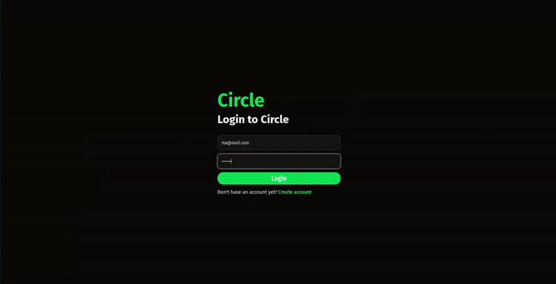

# Circle
> Social media app to create your own circle and connect with your community




## Demo
[🚀 Live Demo](https://appcircle.netlify.app)


## Table of Contents
- [About](#about)
- [Features](#features)
- [Tech Stack](#tech-stack)
- [Installation](#installation)
- [License](#license) 

## About
Circle is a social media platform that allows users to create their own circles, share threads, and interact with communities.  
It is suitable for interest groups, clubs, and personal networks.  

## Features
- **Threads**: Post, comment, and interact with discussions  
- **Search Users**: Quickly find friends or communities  
- **Follow System**: Follow friends and join circles  
- **Profile**: Personal profile with activity feed  
- **Responsive UI** built with TailwindCSS and Shadcn/UI  

## Tech Stack
**Backend:** Node.js, Express.js, Prisma  
**Frontend:** React, Vite, TailwindCSS, Shadcn/UI  
**Other:** Redis (Upstash), JWT Authentication   

## Installation

### Backend Setup

```bash
git clone https://github.com/tosrv/circle-app.git
cd circle-app/BE
npm install
```

- Copy `.env.example` to `.env` and update the variables:

```env
DATABASE_URL=your_database_url
PORT=your_port
JWT_SECRET=your_jwt_secret
BASE_URL=your_backend_url
CORS=your_frontend_url
UPSTASH_REDIS_URL=your_redis_url
UPSTASH_REDIS_TOKEN=your_redis_token
```

- Run the backend server:

```bash
npm run dev
```

- Test backend by visiting `http://localhost:3000` (should return `Hello`)

### Frontend Setup

```bash
cd ../FE
npm install
```

- Update backend URL in:
  - `vite.config.ts`
  - `src/services/api.ts`

- Run frontend server:

```bash
npm run dev
```

- Visit `http://localhost:5173` to see the app

## License
MIT License